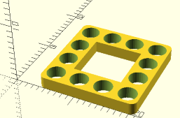
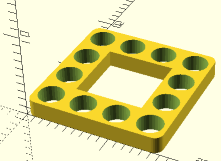
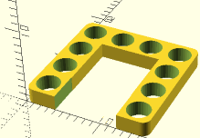
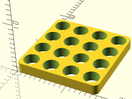
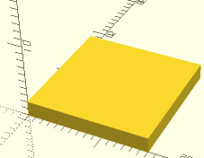
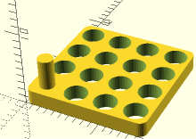
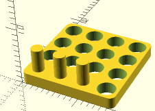

Modulus permet de créer des boitiers facilement sur openscad, grâce à un ensemble de modules.


-- IMAGE

# Utilisation
Importer les modules au début de votre fichier scad.   
```
// Base
use <base/protos.scad>
use <base/block.scad>
use <base/espacios.scad>
use <base/panelas.scad>
use <base/screw.scad>
```

Ouvrez le fichier new.scad pour voir un example.


# Objets
Chaque objet est créer à l'aide de fonctions.   
Ils prennent comme paramètres trois valeurs: x / y / z  
Chaque bloc fait 4mm et les trous font 2mm
* **x** : Nb de bloc sur l'axe X
* **y** : Nb de bloc sur l'axe Y
* **z** : Taille en mm

Certains objets peuvent aussi avoir des angles arrondis   
* **fillet** : true/false

Les paramètres sont tous facultatifs.

## move()
Déplace un bloc    

```
move(x=1) espacios();
```
## espacios()
Un bloc vide (avec des trous)   

```
espacios(x=4,y=4,z=2,fillet=true);
```
## block_espacios()
Un bloc vide sans trous pour faire des différences   

```
difference(){
    espacios();
    move(x=1) block_espacios(x=2,y=1);
}
```

## panelas()
Un bloc plein (avec trous).   

```
panelas(x=4,y=4,z=2,fillet=true);
```
## block_panelas()
Un bloc plein (sans trous)   

```
block_panelas(x=4,y=4,z=2,fillet=true);
```

## screw()
Génère une vis dans un bloc   

```
panelas(x=4,y=4,z=2,fillet=true);
screw(z=2,screw_z=4,upper=false)
```

## horizontal_screw()
Génère une rangée de vis horizontale   

```
panelas(x=4,y=4,z=2,fillet=true);
horizontal_screw(x=3,z=2,screw_z=4,upper=false);
```
## vertical_screw()
Génère une rangée de vis verticale   

```
panelas(x=4,y=4,z=2,fillet=true);
vertical_screw(y=3,z=2,screw_z=4)
```